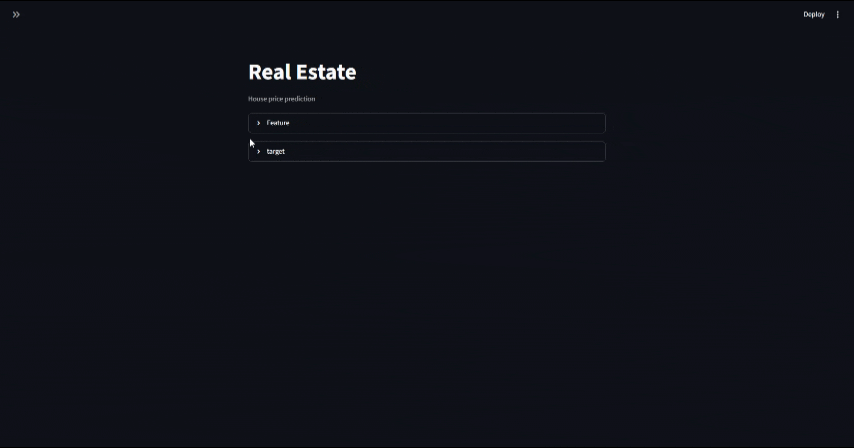

#  House Price Prediction

Machine Learning project for predicting house prices using Linear Regression with FastAPI, Streamlit and Docker.


## Project Overview

This project predicts house prices based on several features such as:

- Square Feet
- Bedrooms
- Bathrooms
- Floors
- Year Built
- Garage Size
- Location Score

The prediction model is served using FastAPI and the user interface is built with Streamlit.

## Demo



## Features

- Data preprocessing
- Feature Engineering
- Model Training
- Model Evaluation
- FastAPI REST API
- Streamlit Dashboard
- Docker Support

## Technologies

- Python
- Pandas
- NumPy
- joblib
- Scikit-learn
- FastAPI
- Streamlit
- Docker

## Machine Learning Pipeline

- Data Cleaning
- Feature Engineering
- Train Test Split
- Model Training
- Model Evaluation
- Model Saving

## Model Performance

R² Score

0.97

MAE

16769

MSE

4180

In my model, it can predict 97% correctly and has an average of 16,000 errors, which indicates a very good and high performance of the model.


## API Endpoints

POST /predict

GET /data

### Request a sample
```json
{
  "Square_Feet": 199.66,
  "Num_Bedrooms": 5,
  "Num_Bathrooms": 2,
  "Num_Floors": 2,
  "Year_Built": 1918,
  "Has_Garden": 0,
  "Has_Pool": 0,
  "Garage_Size": 17,
  "Location_Score": 2.07,
  "Distance_to_Center": 8.28
}
```
### Response a sample

```json
{
  "prediction": 590848.3012306448
}
```
We give the features of a house to the trained model and the model returns the price of the house to us.


## Docker

Run

docker compose up --build

Prerequisite:
Have Docker and Docker Compose installed on your system to avoid problems.


## Run Without Docker

```bash
git clone ...
cd project

python -m venv .venv

# Windows
.venv\Scripts\activate

# Linux / macOS
source .venv/bin/activate

pip install -r requirements.txt

# Run FastAPI
uvicorn app.api:app --reload

# Run Streamlit
streamlit run app/ml_app.py
```

### Project address

Run docker compose or fastapi and streamlit simultaneously. The following links can be used.

API -> http://127.0.0.1:8000/docs

Streamlit -> http://localhost:8501/


## Streamlit
We used Streamlit to build dashboards and a web app to showcase machine learning performance.


## Author

Your Name-> amir mohammad abdol shaikhy

GitHub-> [mr-prop](https://github.com/mr-prop)

Email-> amirmohammadshai@gmail.com
